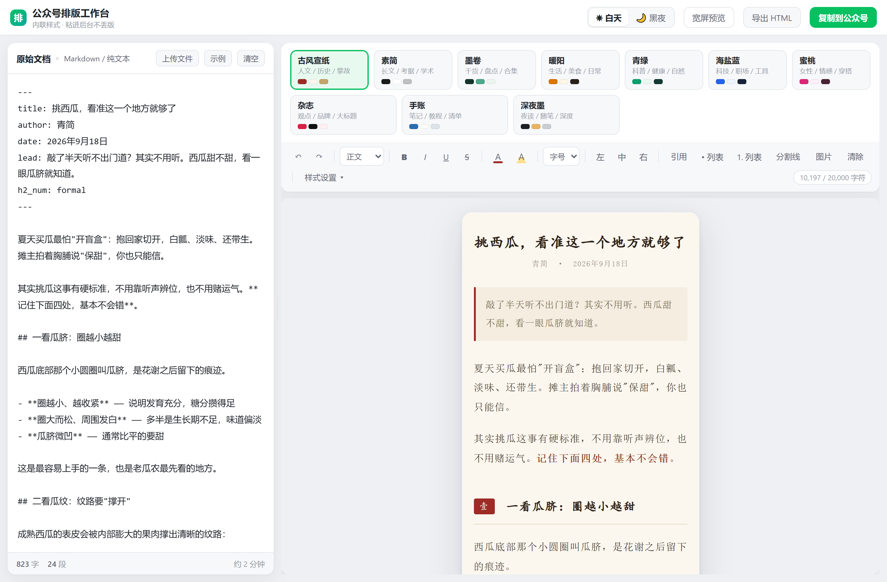
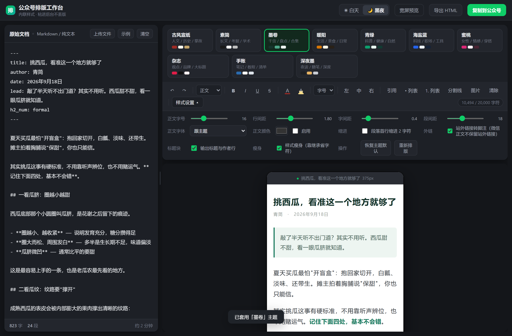

# 公众号排版工作台

> 粘贴文稿 → 点主题 → 复制 → 粘进公众号后台，版式不丢。

一个**单文件、零构建、纯前端**的微信公众号排版工具。左边贴原始文稿，右边实时出排版结果，10 套主题一键切换，导出的是微信编辑器**能原样保留**的内联样式正文。

**在线使用：** <https://wechat-typeset-studio.app.workbuddy.host/>

文稿不上传，全部排版运算都在你自己的浏览器里完成，没有后端、没有账号。



<sub>白天主题：左侧原始文稿，右侧手机宽度预览，中间分隔条可拖拽调栏宽</sub>



<sub>黑夜主题：只是工作台自己的配色，不影响排版结果（预览纸张始终是主题设定的底色）</sub>

---

## 它解决什么问题

微信公众号编辑器有一条硬性行为：

> 贴进正文区的 HTML，**`<style>` 标签、`class`、`id`、伪元素会被全部剥掉，只有写在元素上的内联 `style=""` 能活下来。**

所以你会遇到这些事：在别处排好的版，粘进后台就散了——标题装饰没了、引用块退化成普通段落、列表符号被重排、自定义字体失效。

这个工具的输出**从一开始就只为那个环境准备**，而不是"先排好看再祈祷能过"：

| 约束 | 做法 | 原因 |
| --- | --- | --- |
| 样式必须内联 | 每个元素带完整的 `style=""`，不依赖任何样式表 | `class` / `<style>` 活不过过滤 |
| 装饰不能用伪元素 | 汉字序号、项目符号、分割线全部用真实 `<span>` 实现 | 伪元素是第一批被清掉的 |
| 标签必须安全 | 只用 `section`/`p`/`span`/`img`/`table`/`td` | 微信对 `h1-h6`/`ul`/`ol`/`li`/`blockquote` 有自带样式与重排，会盖掉你的设定 |

**一句话：它不是"排得好看"，而是"排完还能原样活下来"。**

## 功能

**输入**

- 直接粘贴，或上传 `.md` / `.markdown` / `.txt` / `.html` / `.htm` / `.docx`（`.docx` 走浏览器内转换）
- 整页拖放文件；拖入图片即插图（先在本地压缩再入库）
- 左栏实时显示字数、段数、预计阅读时长

**排版**

- 10 套主题，点一下整篇重排。主题入口是工具条最左侧的「主题」按钮（按钮上带当前主题的三色色标），点开是浮层，选完自动收起——不常驻铺开是为了把纵向空间让给预览区
- 全局样式面板：正文字号、行间距、字间距、段间距、字体（跟主题 / 黑体 / 宋体 / 楷体 / 仿宋 / 苹方）、正文颜色、首行缩进 2 字符
- 富文本微调：撤销 / 重做、段落格式（正文 / 小标题 / 大标题）、**加粗**、*斜体*、<u>下划线</u>、~~删除线~~、字体颜色、背景高亮、选中改字号、左中右对齐、引用块、两种列表、分割线、插图、清除格式
- 取色用内置色板（12 色预设 + 十六进制自定义），不调用系统原生取色控件——后者在部分浏览器内核下会被渲染成占位图标，无法做样式控制
- 右侧成品区**可以直接点进去改字**，改完的版本在换主题时不会丢

**插入**（工具条上的「插入 ▾」，共三类）

- **图片**：先定好参数再挑文件，图片在浏览器里用 canvas 重编码后才入库。
  - 可设最大宽度（640 / 800 / 1080 / 1280 / 不缩放）、质量、圆角、对齐、投影、图注
  - 格式「自动」会扫描 alpha 通道：有透明像素存 PNG，否则存 JPEG——所以不透明大图通常能压到原图的百分之几
  - 图片本体存在浏览器里，左侧文稿只留一行 ``，**左栏始终是可读的纯文本**，换主题、重新排版都不会丢图
- **表格**：可视化编辑器，点格子直接敲字，`＋行 / －行 / ＋列 / －列` 按钮作用于光标所在的行列，确认后转成 Markdown 表格写回左侧文档
- **装饰元件**：关注引导卡、作者名片、往期回顾、金句卡、小贴士五种，按当前主题配色生成，插入后用竖线分隔各段文字即可

三类都**插到左侧文稿的光标处**：先在左边点一下要插的位置，再回来点「插入」。没在左侧点过光标就追加到文末（即「直接粘贴一篇文稿就开始排版」的默认路径），连着插几个会依次往后排。插入完成后提示条会写明落在第几行。

**输出**

- 「复制到公众号」——写入剪贴板 `text/html`，到后台正文区 Ctrl+V
- 「导出 HTML」——拿到干净的内联样式源码，可存档或做二次处理
- 预览区底部状态条实时显示 `字符数 / 20,000` 预算（微信 `draft/add` 接口的 `content` 上限，标签属性全算；复制粘贴没有这个限制，超 80% 变黄、超限变红）
- 图片在导出时是自包含的 `data:` URL，粘进后台即可，不依赖图床

**界面**

- 白天 / 黑夜主题切换，记忆上次选择
- 中间分隔条可拖拽调栏宽，也有一键宽屏预览
- 右栏纵向空间优先给预览：主题选择走浮层、字符预算放底部状态条，工具区（工具条 + 状态条）在 1440 宽窗口下只占 62px
- 刷新后自动恢复上次导入的文稿与主题

## 10 套主题

| 主题 | 风格 | 适合内容 |
| --- | --- | --- |
| 古风宣纸 | 宣纸底 + 朱红 + 宋楷 | 人文 / 历史 / 掌故 |
| 素简 | 黑白灰、极简留白 | 长文 / 考据 / 学术 |
| 墨卷 | 墨绿 + 卡片式小节 | 干货 / 盘点 / 合集 |
| 暖阳 | 暖橙 + 柔和描边 | 生活 / 美食 / 日常 |
| 青绿 | 青绿 + 下划线标题 | 科普 / 健康 / 自然 |
| 海盐蓝 | 蓝 + 数据感 | 科技 / 职场 / 工具 |
| 蜜桃 | 粉调 + 缎带标题 | 女性 / 情感 / 穿搭 |
| 杂志 | 大红大黑、大标题 | 观点 / 品牌 / 大标题文 |
| 手账 | 米色纸感 + 手写感 | 笔记 / 教程 / 清单 |
| 深夜墨 | 深底 + 金棕强调 | 夜读 / 随笔 / 深度 |

每套主题的二级标题样式、引用块样式、项目符号、分割线字符、配色都是独立配置的，不是换个色号而已。

## 快速开始

**方式一：直接用**

打开 <https://wechat-typeset-studio.app.workbuddy.host/>，或把 `index.html` 下载到本地双击。无需安装、无需服务器、无需构建。

**方式二：部署成自己的站**

整个应用只有一个 `index.html`，没有任何外部资源依赖（唯一的外部请求是导入 `.docx` 时按需从 CDN 取一次转换库）。丢到任何静态托管都能跑：

- GitHub Pages：本仓库根目录就是入口，仓库 Settings → Pages 里选分支即可
- Cloudflare Pages / Vercel / Netlify：直接用，不用填构建命令
- 国内对象存储（腾讯云 COS / 阿里云 OSS）静态网站托管：绑定自有域名需先完成 ICP 备案

## 使用流程

1. 左栏粘贴文稿（或上传文件）
2. 点工具条最左侧的「主题」按钮，在浮层里选主题，预览立刻更新
3. 需要微调就点「样式设置」或直接用工具条改
4. 点「复制到公众号」
5. 打开公众号后台 → 新建图文 → 光标放进正文区 → `Ctrl+V`

**粘贴后建议核对 5 处**（微信后台偶尔会二次处理）：

- 小标题的装饰与序号
- 图片是否变形（宽度、圆角、居中）
- 段落间距与行距
- 引用块的左边线与底色
- 列表的项目符号

## 支持的写法

文稿按 Markdown 子集解析，也支持纯文本（什么都不写时按空行自动分段）：

```markdown
# 一级标题（作为文章标题，不显示在正文）
## 二级标题（自动带序号）
### 三级标题

> 引用块

- 无序列表
1. 有序列表

---
**加粗**  *斜体*  `行内代码`

| 表头 | 表头 |
| --- | --- |
| 单元格 | 单元格 |


[站外链接](https://example.com)
```

### 装饰元件：一行指令

```
::follow 点击上方蓝字关注我 | 每周三更新
::card 作者 / 你的名字 | 一句话介绍自己
::past 往期回顾 | 第一篇 | 第二篇
::quote 一句想让人记住的话
::tip 一句补充说明
```

`::元件名` 后面跟的字段用 `|` 分隔，个数与顺序见下表；留空则用占位文案。五种元件都会按当前主题配色渲染，换主题不丢。

| 元件 | 字段 |
| --- | --- |
| `::follow` 关注引导卡 | 主标题 \| 副标题 |
| `::card` 作者名片 | 姓名 \| 简介 |
| `::past` 往期回顾 | 小节标题 \| 条目一 \| 条目二 \| … |
| `::quote` 金句卡 | 句子 |
| `::tip` 小贴士 | 正文 |

工具条「插入 ▾ → 装饰元件」会直接把这一行写到你左侧文稿的光标处，改文字即可。

可选在文首加 frontmatter 控制元信息：

```yaml
---
title: 文章标题
author: 作者名
date: 2026年9月18日
lead: 导语，会渲染成带左边线的强调块
h2_num: formal
---
```

`h2_num` 取 `formal`（壹贰叁）/ `common`（一二三）/ `arabic`（1 2 3），不写则跟主题默认。

**关于站外链接**：微信正文不保留指向站外域名的超链接（点了跳不过去）。默认行为是把站外链接收拢到文末的「参考资料」段落，可在「样式设置 → 外链」里关掉。

## 字符预算与样式瘦身

微信 `draft/add`（推草稿箱接口）对 `content` 有 **20000 字符硬上限，且标签和属性全部计入**。一篇带足量装饰的长文很容易撞线。

- **样式瘦身**（默认开启）：删掉那些"与祖先元素完全同值、且本来就可继承"的声明，让它靠 CSS 继承生效。因为只删**完全同值**的，渲染结果可证明不变。实测约省两成字符。
- 万一个别位置出现样式丢失，在「样式设置 → 瘦身」里关掉即可，代价是字符数上升。

注意：这个限制只针对推草稿箱接口。**复制粘贴到后台没有字符上限**，长文走粘贴路径即可。

## 测试

用真实 Chrome 跑的端到端断言，覆盖渲染、微信合规性、交互链路与持久化：

```bash
npm install
npm test
```

97 项断言，全部通过则退出码为 0；明细写到 `test/verification-report.txt`，截图写到 `test/artifacts/`。

默认使用本机安装的 Google Chrome，没有 Chrome 可以改用 Edge 或指定路径：

```bash
PW_CHANNEL=msedge npm test
PW_EXECUTABLE="C:\Program Files\Google\Chrome\Application\chrome.exe" npm test
```

其中几条含金量比较高的断言：

- **导出 HTML 白名单体检**：无 `<style>` / `class` / `id` / `data-*` / `contenteditable` / `position|float|flex|grid`，且所有块级标签都带内联 `style`，也不含 `ul`/`ol`/`blockquote`/`h1-h6` 裸标签
- **样式瘦身不影响渲染**：把瘦身前后的两份导出 HTML 分别塞进离屏 iframe，**逐元素 × 19 项 `getComputedStyle` 比对，要求零差异**
- 10 套主题两两配色互不相同、且切换后正文不横向溢出 375px 手机宽度
- 剪贴板写入成功且确实带 `text/html`（否则粘到后台会丢样式）
- **工具栏零非文字渲染**：区域内不含 `img`、不含外链背景图、不含任何原生取色控件（这是「工具栏出现裂图」的根因防线）
- **右栏纵向空间分配**：主题弹层默认收起、展开时不占布局高度（浮层），工具区高度 ≤ 100px、预览区高度占右栏 ≥ 83%
- **插入三类内容端到端**：图片走真实文件选择 → 压缩到指定宽度 → 入库 → 渲染 → 换主题仍在 → 导出成品里逐图样式没被抹掉；表格走可视化编辑 → 增删行列 → 转 Markdown → 渲染；装饰元件写入 `::名称` → 渲染成卡
- **插入点跟随左侧光标**：光标置于文档中段时插入落在光标处、连着插两个会依次往后排、没碰过左侧时仍追加到文末
- 全流程无未捕获 JS 错误

## 已知边界

- **浏览器**：完整验证在 Chrome 上完成。用到 `Clipboard API` 和 CSS `:has()`，其他 Chromium 内核浏览器（Edge、360 极速等）理论可用但未逐一验证。
- **`.docx` 导入**需要联网取一次转换库，且复杂排版（多栏、文本框、浮动图片）转换后会简化。想要精确控制，建议先用 Markdown。
- **图片**：插入的图片会先压到设定宽度再存进浏览器，左侧文稿里只留一行 `asset:` 引用。导出时展开成自包含的 `data:` URL，粘进后台即可。两点注意：一是 `data:` URL 仍会推高字符数（所以别把「不缩放 + PNG 无损」用在长文里）；二是微信后台对 `data:` 图片的处理偶尔不稳，稳妥做法是粘完在后台重新上传一遍。
- **图片存储上限**：图片本体存在浏览器 `localStorage` 里（一般 5MB）。图片太多会写不进去，此时工具会自动改为只保存文稿并在界面上提示——**文稿永远优先**，但刷新后需要重新插图。
- **手机端**：界面按桌面双栏设计，手机上能打开、能操作，但体验不如桌面。

## 目录结构

```
.
├─ index.html          # 应用本体，单文件，就是全部
├─ test/e2e.mjs        # 端到端验证脚本
├─ docs/
│  ├─ screenshot-*.png          # 界面截图
│  └─ verification-report.txt   # 最近一次验证明细
├─ package.json        # 仅为跑测试，应用本身不需要
└─ LICENSE
```

## License

[MIT](LICENSE)
